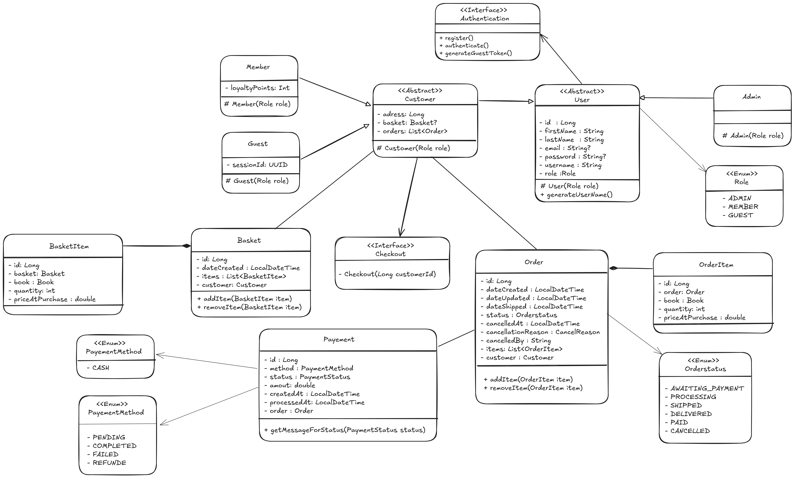
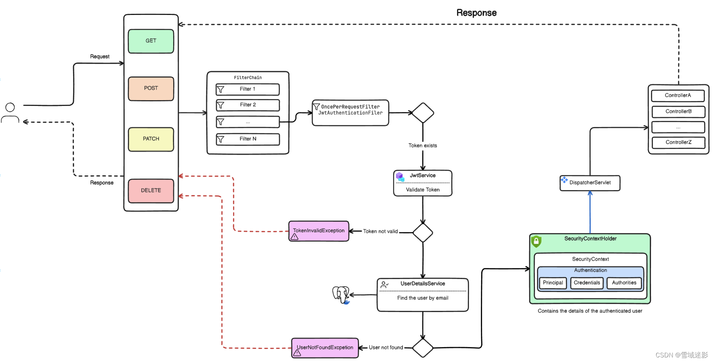

# 📚 bookstore API – Backend

RESTful API for managing a bookstore's inventory and customer orders. It is built with Spring Boot and follows best practices for scalable, maintainable, and secure API development.

---

### 📑 Table of Contents

- [Overview](#overview)
- [Key Features](#key-features)
- [Technologies Used](#technologies-used)
- [Setup Instructions](#setup-instructions)
- [License](#license)

---

### 🔍 Overview

**Book Store API** is a stateless backend application designed to power a modern online bookstore. It enables customers to browse books, place orders, and manage returns. It supports both **authenticated users** and **guests**, allowing guests to place orders without registration.

The API also includes secure **admin-level endpoints**, enabling administrators to manage the book catalog, validate orders, and process return requests. Built with **Spring Boot 3** and **Spring Security 6**, it uses **JWT-based authentication** and follows REST best practices to ensure maintainability, scalability, and clarity.

---

### ✅ Key Features

- **User Registration & Authentication**
  - Register, login, and secure access via JWT tokens.
  - Guests can place orders without creating an account.

- **Book Catalog Management** (Admin Only)
  - Admins can add, update, delete, and publish books.
  - Full control over book visibility and metadata.

- **Order Management**
  - Customers can place and (if authenticated) track their orders.
  - Orders can be updated or canceled based on business rules.
  - Admins can validate and process orders.

- **Return Workflow**
  - Customers may request to return purchased books.
  - Admins approve or reject return requests.

- **Role-Based Access Control**
  - Roles: `ADMIN`, `CUSTOMER`, `MEMBER`, `GUEST`.
  - Business logic and endpoint access depend on user roles.


Class diagram



Spring security diagram


---

### 🛠 Technologies Used

- Spring Boot 3.4
- Spring Security 6
- Spring Data JPA
- Spring Validation
- JWT Token Authentication
- PostgreSQL
- Docker & Docker Compose
- Swagger (OpenAPI 3)

---

### ⚙️ Setup Instructions

#### 🔧 Prerequisites

Make sure you have the following installed:

- [Docker & Docker Compose](https://docs.docker.com/get-docker/)
- Maven (only if building manually outside Docker)

---

#### 🚀 Steps to Run the Backend Locally

1. **Clone the repository**

   ```bash
   git clone https://github.com/sebai-dhia/bookstore-api.git
   ```

2. **Navigate into the project directory**

   ```bash
   cd bookstore-api
   ```
3. **Build the project using Maven**

   ```bash
   ./mvnw  clean install
   ```

4. **Configure the environment variables**

   Create a .env file in the project root:

   ```bash
   nano .env
   ```

   Example content:

   ```text
   # PostgreSQL container
   POSTGRES_PASSWORD=admin
   POSTGRES_USER=postgres
   POSTGRES_DB=book

   # Database
   DB_URL=jdbc:postgresql://db:5432/book
   DB_USERNAME=postgres
   DB_PASSWORD=admin

   # JWT
   JWT_SECRET=book-secure-secret-key-07102023-X-JWT-FILTER-XWT-123__9WJ
   JWT_EXPIRATION=86400000

   # Admin User Setup
   ADMIN_EMAIL=dev-code.admin@gmail.com
   ADMIN_PASSWORD=BookStorePass123&
   ADMIN_FIRSTNAME=User
   ADMIN_LASTNAME=User
   ADMIN_BIRTHDATE=2025-06-21
   ```

6. **Run the application using Docker Compose**
   ```bash
   docker-compose up --build
   ```

7. **Access the API documentation**

   Open your browser at:
    ```text
   👉 http://localhost:8082/api/v1/swagger-ui.html
    ```

📄 License
This project is licensed under the MIT License.
